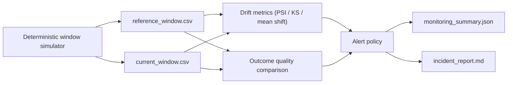

# model-monitoring-drift-lab

A local-first ML monitoring lab that simulates a healthy reference window and a degraded current window, measures feature and prediction drift, evaluates delayed-outcome quality, and produces an incident-style monitoring report.

## Problem

Training and serving are not enough for a credible ML system. Once a model is live, teams need a disciplined way to detect whether input features have shifted, prediction behavior has changed, and downstream quality has degraded after labels arrive. This repo focuses on that post-deployment monitoring path.

## Architecture

The V1 implementation keeps the surface compact but complete:

- a deterministic simulator writes reference and current prediction windows with delayed outcomes
- monitoring logic computes per-feature PSI, prediction-distribution shift, and outcome-quality deltas
- alert rules convert metric movement into healthy, warning, or critical incidents
- a reporting layer writes both machine-readable JSON and a public-facing Markdown incident summary
- a read-only FastAPI surface serves the current summary and report for Render or local inspection

## Monitoring Signals

The important metrics are intentionally explainable:

- `PSI` highlights whether a feature distribution has shifted enough to deserve attention.
- `KS` compares the shape of the reference and current distributions.
- `KL divergence` helps describe how surprising the current distribution is relative to the baseline.
- mean shift and outcome deltas explain whether the model is degrading even when the distribution change is not dramatic on its own.

These signals are combined into an alert policy instead of being presented as isolated statistics.



## Tradeoffs

This V1 makes three deliberate tradeoffs:

1. The repo uses deterministic synthetic monitoring windows instead of a streaming source so the entire workflow remains reproducible offline.
2. Drift detection is implemented with transparent custom metrics rather than a larger monitoring platform dependency because interview clarity matters more than framework breadth in the first version.
3. Reporting is artifact-driven JSON plus Markdown instead of a live dashboard so the quality gate stays scriptable and easy to verify locally.

## Run Steps

### Install Dependencies

```bash
git clone https://github.com/srn91/model-monitoring-drift-lab.git
cd model-monitoring-drift-lab
python3 -m pip install -r requirements.txt
```

### Generate the Monitoring Windows

```bash
make simulate
```

That produces:

- `generated/reference_window.csv`
- `generated/current_window.csv`

### Generate the Monitoring Report

```bash
make report
```

That produces:

- `generated/monitoring_summary.json`
- `generated/incident_report.md`

Example dashboard-style snapshot:

```text
severity: critical
top_feature_drift: prediction_latency_ms (PSI 2.0372)
prediction_shift: KS 0.6170
reference_default_rate: 0.0885
current_default_rate: 0.2805
reference_log_loss: 0.2889
current_log_loss: 0.5905
action: investigate data shift and model decay before the next deployment
```

### Run the Full Quality Gate

```bash
make verify
```

### Serve the Monitoring API

```bash
make serve
```

By default the server binds to `0.0.0.0:8000`. Override the port the same way Render does:

```bash
PORT=10000 make serve
```

The read-only API exposes:

- `GET /health`
- `GET /summary`
- `GET /report`

## Validation

The V1 repo currently verifies:

- deterministic generation of 2,000 reference rows and 2,000 current rows
- feature drift alerts for the shifted current window
- prediction-distribution shift and delayed-outcome quality comparison
- a machine-readable summary and incident-style Markdown report produced from the same metrics
- a read-only FastAPI hosting surface that reuses the same summary/report logic

The report is artifact-first on purpose, so a reviewer can inspect the JSON, the Markdown summary, and the generated rows without needing a live dashboard.

Current expected report snapshot:

- overall severity: `critical`
- strongest PSI feature: `prediction_latency_ms` at `2.0372`
- prediction KS statistic: `0.6170`
- reference default rate: `0.0885`; current default rate: `0.2805`
- reference log loss: `0.2889`; current log loss: `0.5905`
- incident report and JSON summary both emitted under `generated/`

Local quality gates:

- `make lint`
- `make test`
- `make report`
- `make serve`
- `make verify`

### Render Deployment

Render can deploy this repo as a web service with:

- build command: `python3 -m pip install -r requirements.txt`
- start command: `make serve`
- port: Render injects `PORT`, which `make serve` respects

## Hosted Deployment

- Live URL: `https://model-monitoring-drift-lab.onrender.com`
- Click first: [`/openapi.json`](https://model-monitoring-drift-lab.onrender.com/openapi.json)
- Browser smoke: Render-hosted `/openapi.json` loaded in a real browser and exposed the live `/health`, `/summary`, and `/report` contract; direct HTTP checks also returned `200` for `/summary` and `/health`.
- Render service config: Python web service on `main`, auto-deploy on commit, region `oregon`, plan `free`, build `python3 -m pip install -r requirements.txt`, start `make serve`, health check `/health`.
- Render deploy command: `render deploys create srv-d7n659gsfn5c73dsss6g --confirm`

## Next Steps

Realistic next follow-up work:

1. add rolling daily windows instead of a single current snapshot
2. model missing-label lag explicitly and split leading versus lagging alerts
3. emit an HTML dashboard artifact on top of the JSON summary
4. compare champion and challenger model versions in the same report
5. connect the simulator contract to a warehouse or feature-store export format
