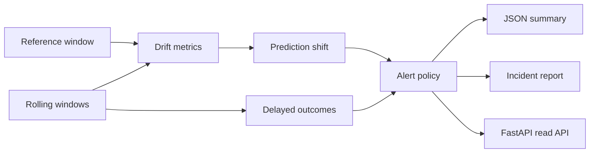

# Model Monitoring Drift Lab - System Brief

## Problem

Model quality can degrade after deployment because feature distributions, prediction behavior, and delayed outcomes move over time. This project connects drift metrics, prediction shift, delayed-outcome quality, alerting, and reporting in one reproducible monitoring workflow.

## System Design



## Stack

- Python, FastAPI, pytest
- PSI, KS, KL divergence, delayed-outcome quality checks
- JSON, Markdown, and HTML reporting artifacts
- Render-hosted read-only service

## Metrics

- `2,000` reference rows
- `5` rolling daily windows
- Strongest PSI feature: `prediction_latency_ms = 2.0372`
- Prediction KS statistic: `0.6170`
- Log loss movement: `0.2889 -> 0.5905`

## Run

```bash
make setup
make simulate
make report
make test
make serve
```

Live demo: https://model-monitoring-drift-lab.onrender.com

## Production Scale Improvements

- Feed online predictions and delayed labels from warehouse tables.
- Add model-version and segment-level alert routing.
- Persist alert history for incident review and rollback decisions.
- Add dashboard filters for feature group, model version, and business segment.
